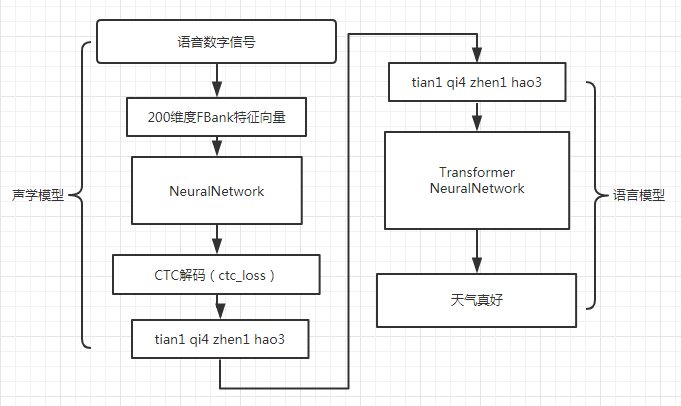

# Corpus
- ai_shellv1
- thchs30
- aidatatang
- st-cmds
- primewords

# Deep Convolutional Neural Network SpeechRecognition
- acoustic model is designed by dfcnn and ctc
- language model is designed by transformer encoder
```python
    python3 train.py
    python3 test.py
```
## model structure


# End2end speech Recognition with Transformer
- model is designed by transformer from filter bank to chinese
```python
    python3 transformer_train.py
    python3 transformer_test.py
```
## model structure


